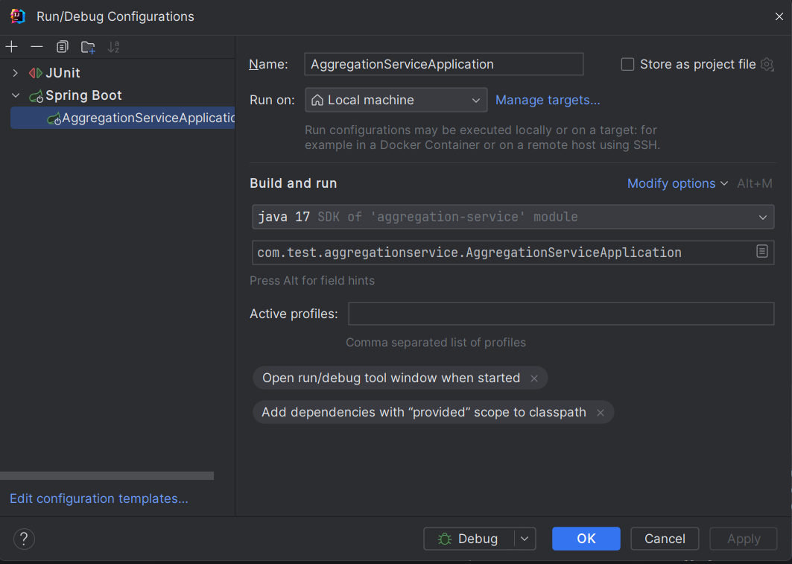

# Aggregation Service

## ADRs

* [ADR-0001](doc/adr/0001-spring-webflux-usage.md) - Usage of spring webflux framework
* [ADR-0002](doc/adr/0002-trigger-call-for-each-parameter.md) - Trigger a webclient call for each parameter received on request
* [ADR-0003](doc/adr/0003-bulk-requests.md) - Batch parameters sent to backend services
* [ADR-0004](doc/adr/0004-add-timeout-for-request-batches.md) - Add timeout for each batch to avoid long aggregation responses

## Get Started

### Pre-requisites

* JDK 17
* Docker

### Command

```
./mvnw spring-boot:run
```

### IntelliJ




### Docker Compose support
This project contains a Docker Compose file named `compose.yaml`.

This file is used Spring Boot Docker Compose support and it contains the dependent services in order to run this project.

